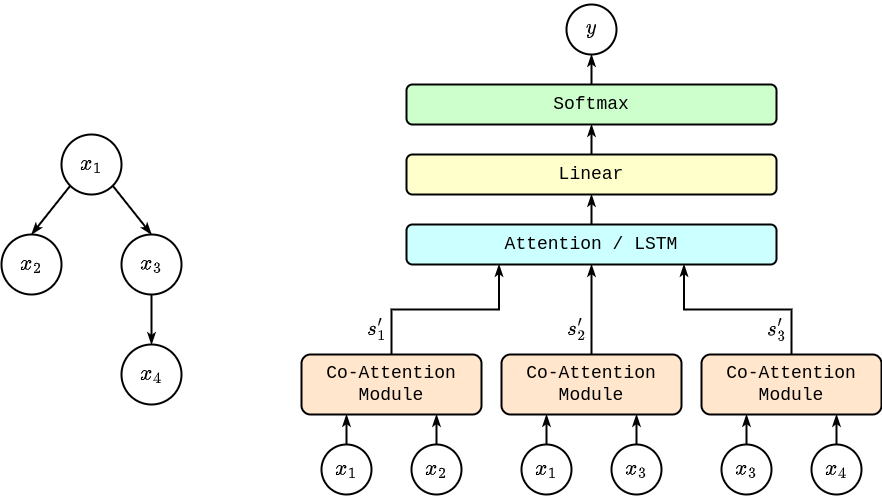

# ReCAN model for claim veracity classification

This repository contains code implementing **ReCAN** (***Re****ply-based **C**o-**A**ttention **N**etwork*) model proposed in my master's thesis "Detecting false claims in social media discussions" as well as code allowing to conduct experiments on the *PHEME* [[1]](#1) dataset.

- [Model Description](#model-description)
- [Quick Start](#quick-start-guide)
- [References](#references)

## Model Description

The aim of the task of claim veracity classification in the *PHEME* dataset is to classify the veracity of the claim as true, false or unverified given the claim and the replies to that claim. Both the claim and the replies are a part of a Twitter conversation originating from the claim (the claim is the source tweet starting the conversational thread).

The main feature of the proposed model is the use of the co-attention mechanism, introduced as *CASA* network in [[2]](#2), to model the local interaction between posts and their direct replies. By using the co-attention mechanism we can produce a vector describing the claim-reply interaction for every such pair in the conversation. This is in the contrary to the method in [[2]](#2) where interaction was modeled between the claim and the concatenation of all (or a filtered part of) the replies.

The prediction is made using either the weighted average of the interaction vectors (using the seq2seq like attention mechanism) or the output of the LSTM layer, where interaction vectors are treated as a sequence (thus including the temporal relationships).

The model architecture, given the sample conversation tree, is visualized below.



## Quick Start Guide

### Install prerequisites

This code uses [poetry](https://python-poetry.org/) to create and manage python virtual environment.

Initialize dependencies by running `poetry install`.

Activate virtual environment by running `poetry shell`.

### Dataset

This code relies on the *PHEME* dataset which can be downloaded [HERE](https://figshare.com/articles/PHEME_dataset_for_Rumour_Detection_and_Veracity_Classification/6392078). The data should be placed in `data/raw` directory.

The LM used to obtain word embedding defaults to `cardiffnlp/twitter-roberta-base`, but any *Hugging Face* model can be used by setting `LANGUAGE_MODEL` environmental variable to an appropriate model name.

### Running scripts

Training metrics are logged to [mlflow](https://mlflow.org/) server. By default a server is expected to be running on `http://localhost:5000`, but that can be changed by modifying the `MLFLOW_TRACKING_URI` environmental variable.

#### dry_run.py

This script allows to test if the virtual environment and data have been set up correctly.

#### train.py

Trains a single model with specified parameters.

running

```bash
python train.py
```

will be equivalent to running:

```bash
python train.py --ds_type='folds' --test_event='charliehebdo' --dim_hidden=120 \
    --dim_feedforward=2048 --nhead=6 --num_layers=1 --mha_dropout=0.5 \
    --dropout=0.8 --use_lstm_out=False --dim_lstm_out=240 --layers_lstm_out=1 \
    --lr=1e-4 --weight_decay=1e-5
```

Version of a model which achieved best validation set loss will be saved in `trained_models` directory.

## References

<span id="1">[1]</span>
A. Zubiaga, M. Liakata, R. Procter, G. Wong Sak Hoi, P. Tolmie.
[Analysing how people orient to and spread rumours in social media by looking at conversational threads.](https://journals.plos.org/plosone/article/file?id=10.1371/journal.pone.0150989&type=printable)
PLOS ONE, 11(3):1–29, 2016.

<span id="2">[2]</span>
Lianwei Wu, Yuan Rao, Yongqiang Zhao, Hao Liang, and Ambreen Nazir. 2020.
[DTCA: Decision Tree-based Co-Attention Networks for Explainable Claim Verification.](https://aclanthology.org/2020.acl-main.97)
In Proceedings of the 58th Annual Meeting of the Association for Computational Linguistics, pages 1024–1035, Online. Association for Computational Linguistics.
